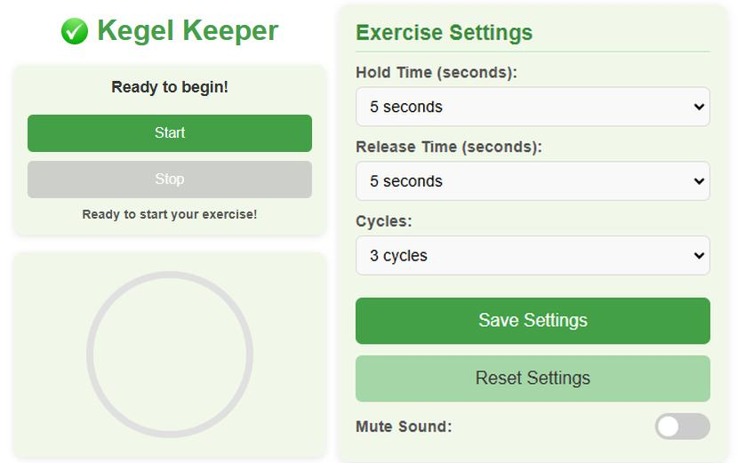

# KegelKeeper: Smart Reminder

**KegelKeeper** is your personal companion for staying consistent with Kegel exercises. Designed to fit seamlessly into your daily routine, this Chrome extension helps you strengthen your pelvic floor muscles with customizable timers and reminders.

Download here: [Chrome Web Store](https://chromewebstore.google.com/detail/KegelKeeper:%20Smart%20Reminder/nioiahlhndbkgjojadohdaanjeecbpoa?hl=en&authuser=0)

---

## Features

- Customizable hold and release durations.
- Adjustable number of cycles for each session.
- Daily and interval-based reminders.
- Visual progress tracking with a circular bar.
- Simple, intuitive interface.
- Optional sound cues for squeeze and release phases.

---

## Screenshot

  
_A snapshot of the intuitive interface._

---

## How to Use

1. **Install the Extension:**

   - Download the extension from the [Chrome Web Store](https://chromewebstore.google.com/detail/KegelKeeper:%20Smart%20Reminder/nioiahlhndbkgjojadohdaanjeecbpoa?hl=en&authuser=0).
   - Click the KegelKeeper icon in your browser toolbar.

2. **Customize Your Exercise:**

   - Set your preferred hold and release times.
   - Choose the number of cycles.
   - Click **Start** to begin your session.

3. **Enable Reminders (Optional):**
   - Set a specific time or interval for reminders.
   - Toggle reminders on or off as needed.

---

## Installation

1. Open the [Chrome Web Store](https://chromewebstore.google.com/detail/KegelKeeper:%20Smart%20Reminder/nioiahlhndbkgjojadohdaanjeecbpoa?hl=en&authuser=0).
2. Search for "KegelKeeper: Smart Reminder."
3. Click "Add to Chrome."

---

## Technical Details

- **Manifest Version:** 3
- **Permissions:**
  - `alarms` for scheduling reminders.
  - `notifications` for displaying alerts.
  - `storage` for saving user preferences.
  - `offscreen` for playing sound cues in the background.

---

## License

This project is licensed under the MIT License. See the `LICENSE` file for more details.

---

## Acknowledgments

Special thanks to all contributors who made this extension possible. Your feedback is invaluable!

---

## Contributing

We welcome contributions! If you have ideas for improvement or want to report an issue, please create an issue or submit a pull request in the GitHub repository.
